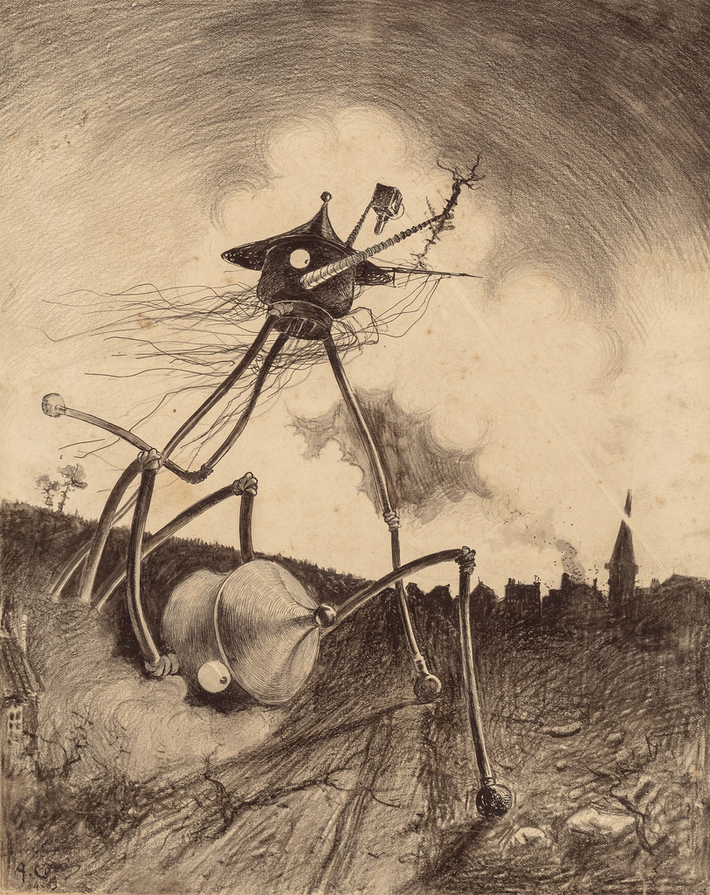

## Digital Project 1: Annotate *The War of the Worlds* 

*The War of the Worlds* was first written in the late 19th century and published as a <q>science romance</q> first in magazines and then as a published book in 1897-1898. The book and challenged readers to visualize an invasion of their communities, neighborhoods, and homes. It also presented alien life forms and technologies in terms of scientific speculations of its moment.

In reading a novel of ideas like this, it helps to annotate the language to look up unfamiliar words and historical references, to provide pictures and media to help an idea from the past come to life in our moment. The assignment involves us writing online annotations as a class group on [the Project Gutenberg HTML edition of *The War of the Worlds*](http://www.gutenberg.org/files/36/36-h/36-h.htm). We will work with the free online annotation software, [Hypothes.is](https://web.hypothes.is/), which will involve some quick initial configuration that we will do together in class.

### Hypothes.is Annotation 
1. Start by setting up a free account here: <https://web.hypothes.is/start/>

2. With your new account configured, join our private class annotation group here by following this link:  <https://hypothes.is/groups/KV7Pxvyk/2019-upg-science-fiction>
3. Set up hypothes.is to run in your preferred browser, [following the instructions](https://web.hypothes.is/start/). There is an extension in Google Chrome, or a “bookmarklet” for other browsers.

4. Open our [Project Gutenberg HTML edition of *The War of the Worlds*](http://www.gutenberg.org/files/36/36-h/36-h.htm) in your browser, and open the hypothes.is extension or bookmarklet.
5. At the top of the hypothes.is screen, you want to change the share setting from “Public” to our class group, “2019-UPG-Science-Fiction”. This allows us to see each other’s annotations and communicate as a group. 

### The Annotation Assignment
As you read, write annotations in hypothes.is to:
* Explain unfamiliar words. 
    * Since we are reading a novel in British English, try looking up unfamiliar words in the Oxford English Dictionary (via the Pitt Digital Library Database login with your Pitt id and password). Choose what strikes you as the best-fitting definition for word, and explain how this word fits into the context of the larger phrase around it: Why does this word fit here?  
* Identify unfamiliar contexts: Link to informative web references to historical events, proper names, organizations mentioned in the novel, and provide a clear and to-the-point explanation of what significance they have, to help us understand a passage in the novel. 
* Embed relevant images and multimedia from the web in your annotations to help us visualize something more clearly. 
* Comment on passages that strike you as ironic. (Some examples of irony: Verbal irony involves words being used in the opposite way than what they mean. Dramatic irony involves the audience knowing more than a speaking character or narrator does.) 
* Raise questions and respond to each other’s annotations.

Aim to write at least 5 annotations as you read, for each of the three class periods over which we are discussing the novel, for a total of at least 15 - 18 (and you may write more if you wish). Your writing for this assignment is entirely in the annotations you are drafting, so think of these as a series of short explanatory and conversational pieces tuned to specific passages of the play. I will be evaluating your annotations for:
* accuracy in representing definitions and context and pointing to external resources
* accuracy and relevance in commentary on the novel
* clear writing and helpfulness of your annotations in adding to the discussion surrounding this novel. 

*Image source: “Horrifying 1906 Illustrations of H.G. Wells’ War of the Worlds: Discover the Art of Henrique Alvim Corrêa”* Open Culture *9/2/2015. <http://www.openculture.com/2015/09/the-first-illustrations-of-h-g-wells-war-of-the-worlds.html>.* 

