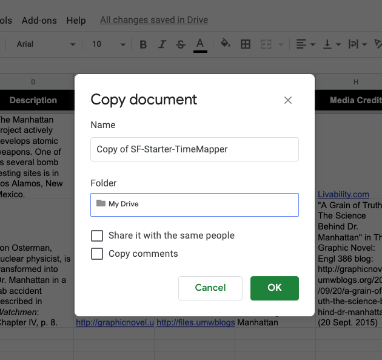
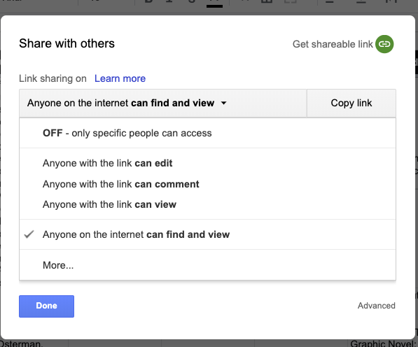

# Instructions for Building a TimeMap 

First, prepare/access your Google Drive: 

1. You will need a Google account to be able to work with Google Drive. [Create a Google account](https://edu.gcfglobal.org/en/googledriveanddocs/getting-started-with-google-drive/print/) if you don’t have one already. If you have a Google account, be sure you can log in to it and access Google Drive. 
1. Create a folder for this class in your Google Drive: perhaps named "scienceFiction" or something convenient for you to quickly locate files you are working on. Make sure you know how to find your folder reliably. 

Now, you need a Google Sheet to start from, as well as Google Sheet template to consult:

Your Starter Google sheet:
1. I have created a starter Google Sheet for you to build on with this assignment. Open [my starter file](https://docs.google.com/spreadsheets/d/1o453IzOC85VMVzF2zW_6CEAKO4sPPeaJYkJy1tGtQg4/edit?usp=sharing).
1. On my starter file, go to File > Make a copy. You’ll open a window like this: 

1. From that window, click on the Folder “My Drive” and find the arrow that lets you navigate to file directories you have created in your Google Drive. Find the folder you made for our class, and click “OK”. (Don't worry about sharing or copying comments; you can leave those boxes unchecked.)
1. Now, find your way to your Google Drive, and your folder, and open the Google Sheet you just copied to your space.
1. On your Google Sheet, click on **File > Publish to the Web**. NOTE: IGNORE AND DO NOT COPY THE LINK YOU SEE ON THE "PUBLISH TO THE WEB" SCREEN. IT IS NOT HELPFUL FOR TIMEMAPPER. THE LINK YOU WANT IS IN THE NEXT STEP!
1. Find and click the green button labeled “Share” in the upper right corner of the Google Sheet. It is most likely set to “OFF - only specific people can access.” Click the down arrow next to the share setting to see your choices, and select “Anyone on the internet **can find and view**”. Your screen should look like this: 

1. To learn what the various fields are for in this sheet, consult this [helpful sheet from TimeMapper](https://docs.google.com/spreadsheets/d/1LlYBnfhvD3ZUXMGZ8e52UwYp-xn_NeWmaGBx7VBz5V8/edit?usp=sharing) with explanations of the column headings and the geo-mapping formula.

Now you are ready to share your Google Sheet with TimeMapper to build a web visualization. 

