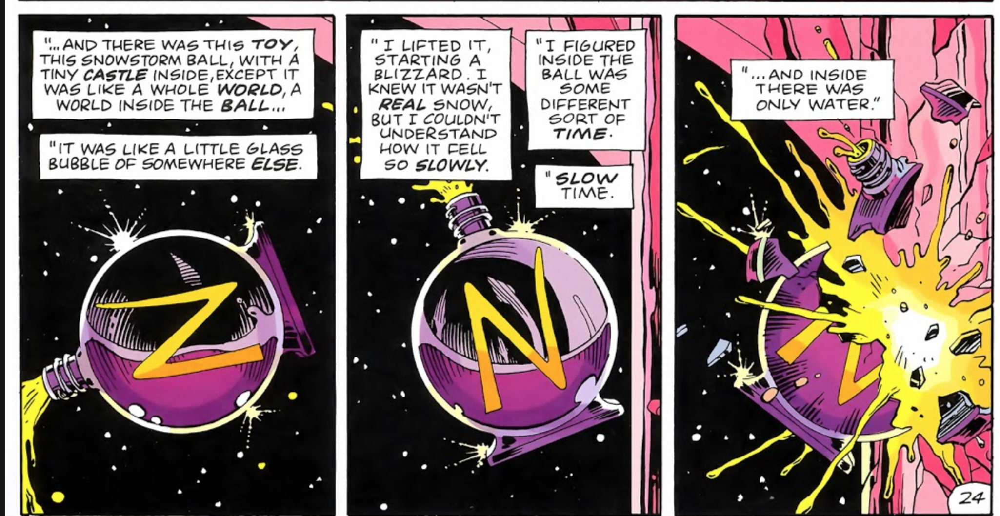
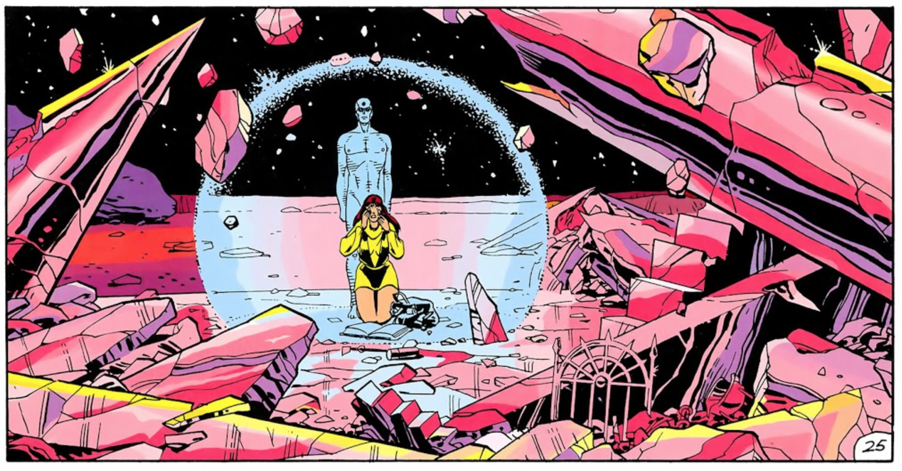

# [Science Fiction](https://ebeshero.github.io/scienceFiction/): *Watchmen* Analysis Exercise 2

Images from [ReadComicOnline.to](https://readcomiconline.to/Comic/Watchmen) (a web reproduction of the 12 issues of *Watchmen* first published serially)

Nostalgia bubble in Chapter IX: Discuss the snowglobe (see page 7, panel 9), the bottle of N(ostalgia) perfume, the clock/ship, and the events on pages 24 and 25. 

What can we learn about martial arts from reading Watchmen? Which (human superhero) characters do we see fighting? 
Which ones are most especially effective and why? 

Who killed Eddie Blake, and why?

What does this have to do with the comic-within-the-comic?
 

